# Event Management

Welcome to my Event Management project. This project builds a system that provides microservices necessary to support event management. The system has APIs for user's logging activities and CRUDs operations to manage user's events and users' registration to an event. The system use Python Django for its backend framework, and PostgreSQL for the database

## Table of Contents
- [Setting Up The Project](#setting-up-the-project)
- [Data Model](#data-model)
- [Overview] (#overview)
- [Testing](#testing)

## Setting Up The Project

#### 1. Clone the repository:

```bash
git clone https://github.com/tarcisiusdaniel/Event-Management.git
```
After you have cloned the project, make sure that you are navigated to the project directory to proceed

#### 2. Install pip3, python3, and PostgreSQL

For this step, you need to make sure <a href = "https://www.python.org/downloads/">python3</a>, <a href = "https://www.activestate.com/resources/quick-reads/how-to-install-and-use-pip3/">pip3</a>,  and <a href = "https://www.postgresql.org/download/">PostgreSQL </a> are setup in your local machine

#### 3. Create a virtual environment (Optional)
This is in case if you want to isolate the dependencies for this project from your local machine.
</br>

```bash
python3 -m venv venv
```

After that, activate the virtual environment
<br />

MacOS
```bash
source venv/bin/activate
```
Windows
```bash
venv\Scripts\activate
```

#### 4. Install the Project Dependencies:

```bash
pip3 install -r requirements.txt
```
The ``requirements.txt`` contains all the dependencies that supports this project to work.

#### 5. Set up the Environment Variables:

For this, you will need .env file that contains the credentials that rooted the services in this project. The sample of the variables needed will be inside the ``.env.example`` file. I will give the values of variables needed for the file to you personally.

#### 6. Create and Migrate the database:

```bash
python3 manage.py migrate
```
This will migrate all the data model and create the tables in the database

#### 7. Run the development server

```bash
python3 manage.py runserver
```
After this command, the project will run, and you will be able to test the microservices built within this project

#### 8. Setup several of the supporting softwares (Recommended)
The softwares listed are really recommended as I used these tools to help running the software and checking to see if the APIs are running correctly.
- <a href = 'https://www.pgadmin.org/download/'>pgAdmin</a>
- <a href = 'https://www.postman.com/downloads/'>Postman</a>

You can substitue pgAdmin with terminal to manage and oversee the Postgre database, and use software other than Postman to test your APIs. However, for simplicity in understanding the [Overview](#overview) section, it is better to use the two software previously mentioned

## Data Model
There are three entities in this data model:
- User
- Event
- Registration

Here is the relations between the models

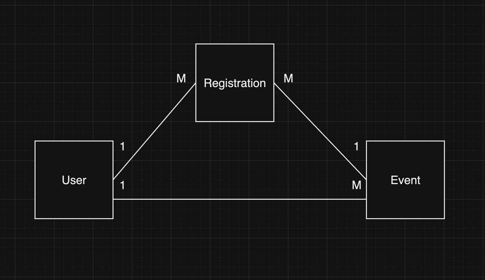

From the picture above, the user has one to many (1->M) relationship, because a user can create and have more than one event(s). The user also has one to many (1->M) relationship, because a user can make more than one registration(s), and a registration can only point to one event. 

The registration has one to many (1->M) relationship because an event can hold more than one registration(s) from a user, and a registration can only point to one user.

## Overview

This passage will show the overview of how the system works by giving explanations and snippets of how the API endpoints work. I will also explain what the API's HTTP methods uses, the things each API needs to work, and the URL endpoints.

The event management system has three applications that builds the [models](#data-model) in the PostgreSQL database and the views (logic behind the services for the models) for the system in Django

Note: This application is still in development, so it will use `http://localhost:8000` to run the application locally in port 8000.

### User

This is the application that handles user logging activity, and authentication by generating and using Json Web Token(JWT) to run the core services APIs of the event management system. 

I set the JWT to expire by 1 hour after creation, meaning that the JWT token will authenticate the user to run the core services of the system in 1 hour.

There are two main URL endpoints that builds the User app operations:

- ``http://localhost:8000/user/login``, 
    - This URL is a POST method used as the end point to log the user in, and post the user in the database if the user does not exist in the database (avoid duplicate users in the database). If you call this when you are not signed in, you will be taken to a standard Django page, where you can sign in by using your Google account.

    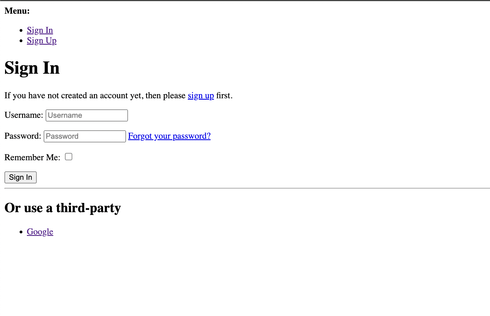

    Click the <b>Google</b> link, and you will be brought to a page to continue signing in using google account

    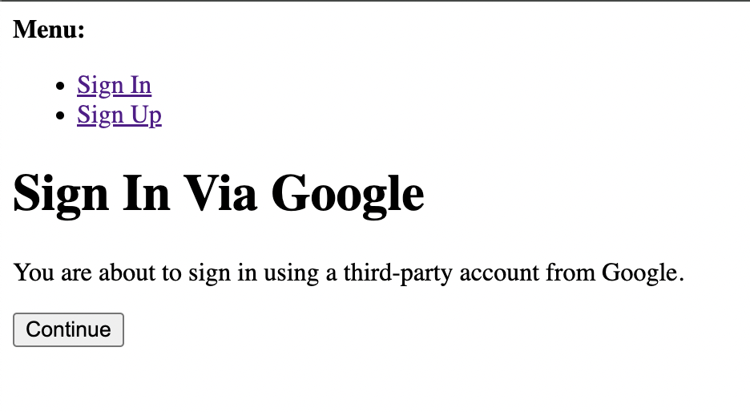

    Click <b>continue</b>, and you will go to the Google SSO page.

    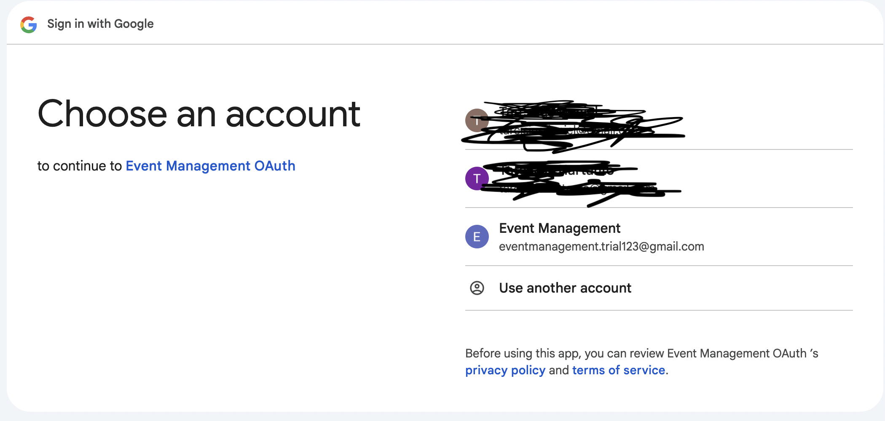

    Then, you will find yourself looking at the page that provides you with your Json Web Token. This will tell you that you have successfully logged in

    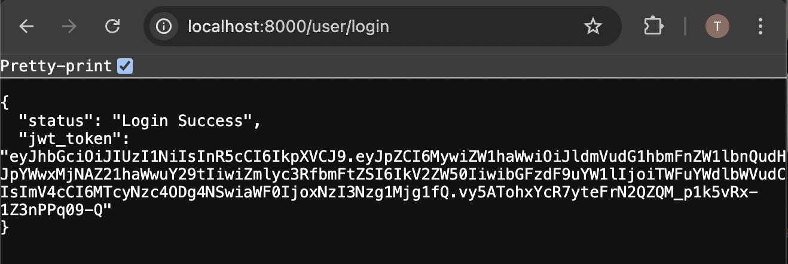

    Notice that you will be able to run the system's main services from the browser, because the JWT is already saved in the cookies, and the main services in this system will grab the JWT in the cookies automatically before executing. 
    
    <b>Note</b>: Save the ``jwt_token`` for testing the services in Postman application.

- `http://localhost:8000/user/logout`
    - Hitting this will erase the user's authentication and JWT in the cookie.

    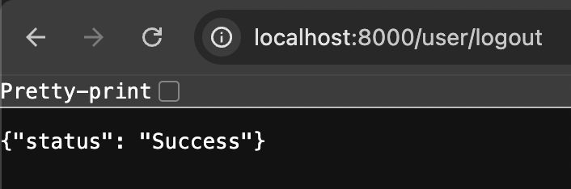


### Event

This is the application that handles the CRUD services to the event model in the database. The user needs to login before accessing these APIs. If not, the user will not be authorized. Here are the end points for the operations:

- `localhost:8000/event/create`
    - This is the URL endpoint with POST method for the logged-in user to create an event. You will need a JSON data that contains the details of the event that wants to be created.

    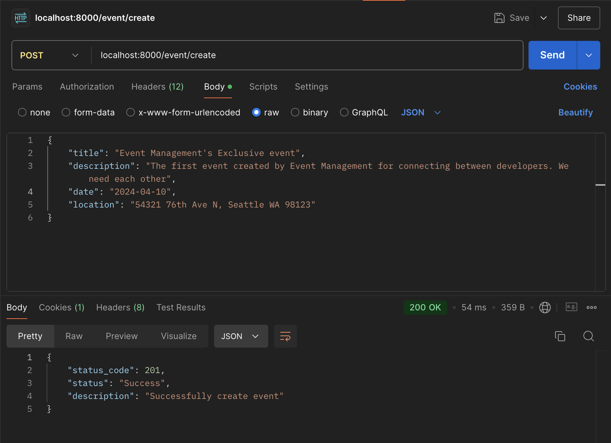
    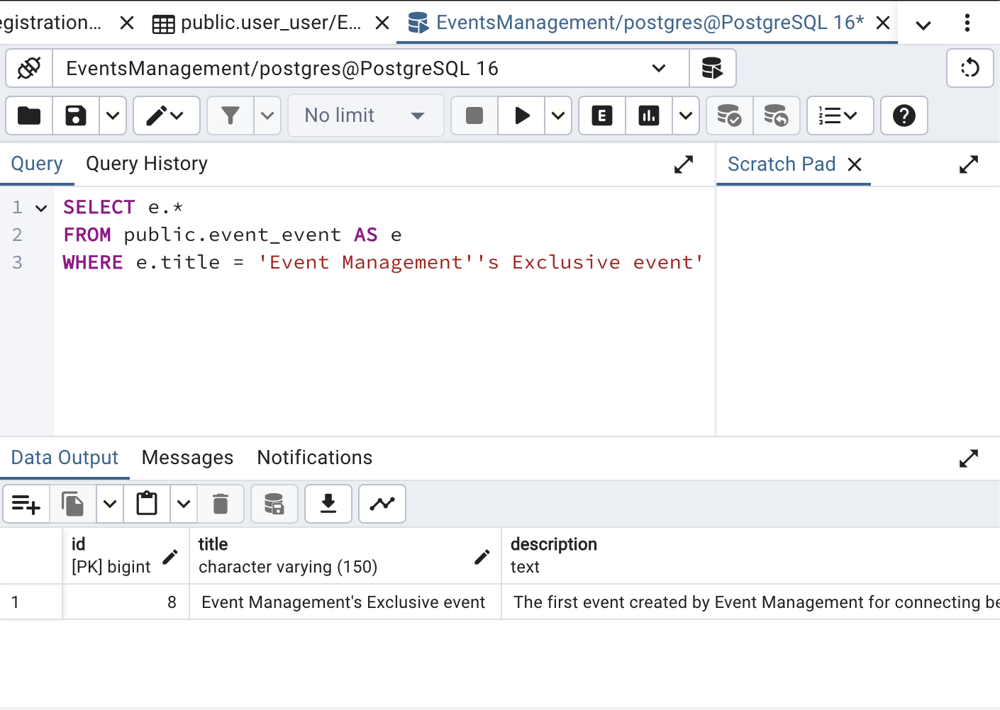

- `localhost:8000/event/retrieve/id/<int:user_id>`
    - This is the URL endpoint with GET method for retrieving list a user's event(s). The user has the id of `<int:user_id>`

    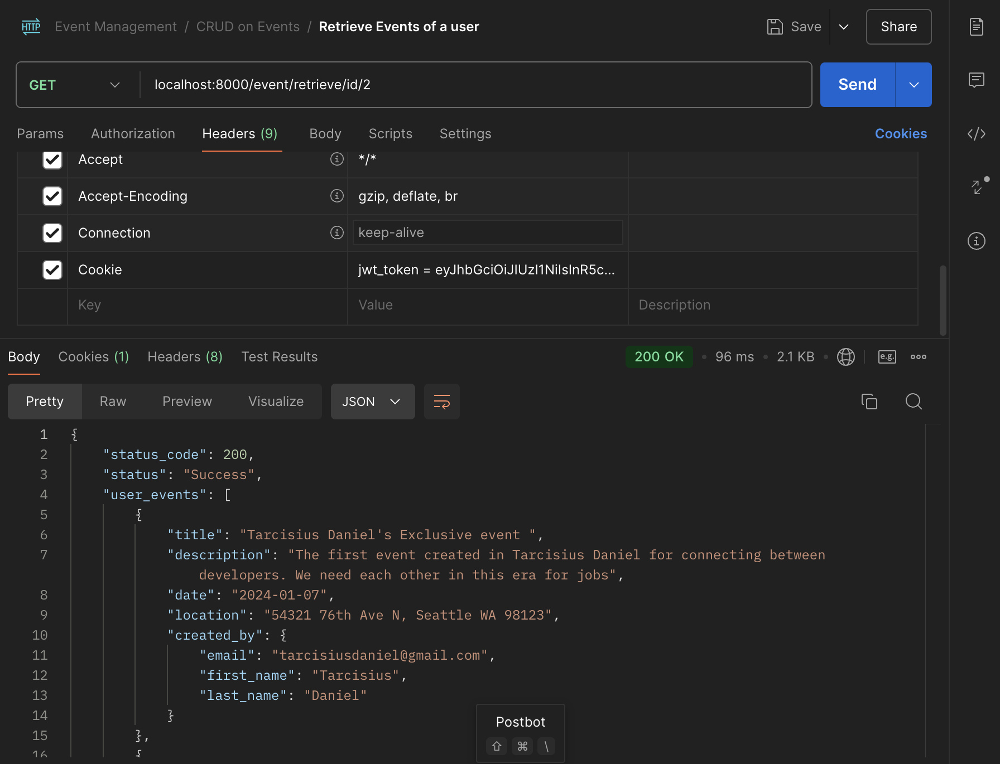

- `localhost:8000/event/retrieve`
    - This is the URL endpoint with GET method for the logged-in user to retrieve the event(s) he/she created

    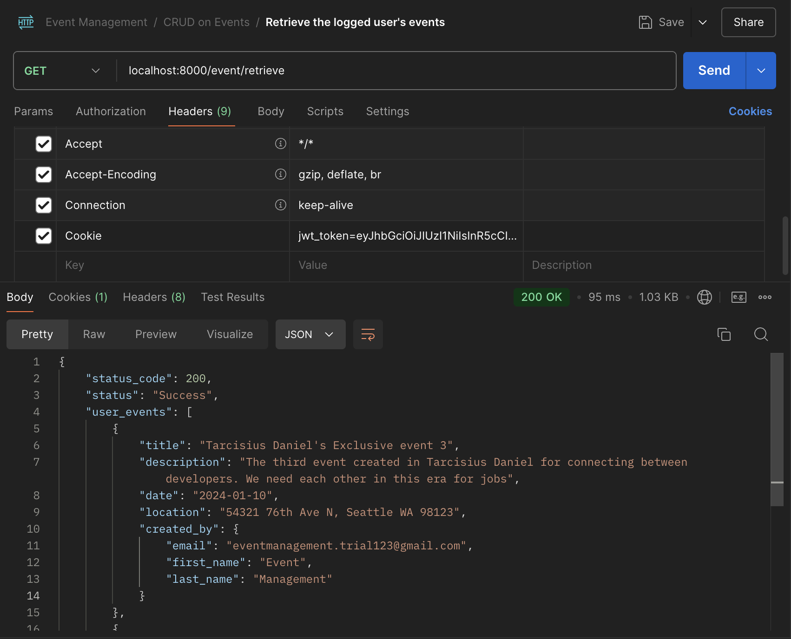

- `localhost:8000/event/delete/id/<int:event_id>`
    - This is the URL endpoint with DELETE method for the logged-in user to delete one of the event(s) he/she created. This will delete the event with id of `<int:event_id>`

    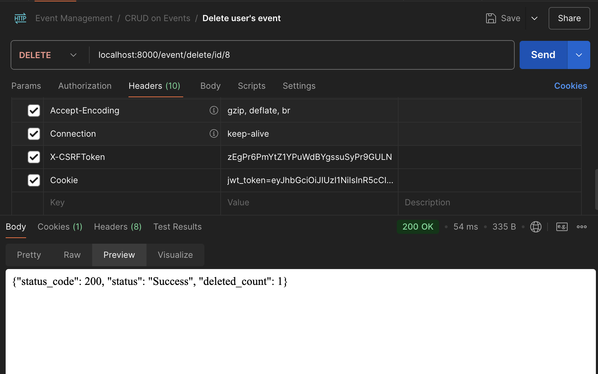

- `localhost:8000/event/update/id/<int:event_id>`
    - This is the URL endpoint with PUT method for the logged-in user to update the details of one of the event(s) he/she created. This will update the event with id of `<int:event_id>`

    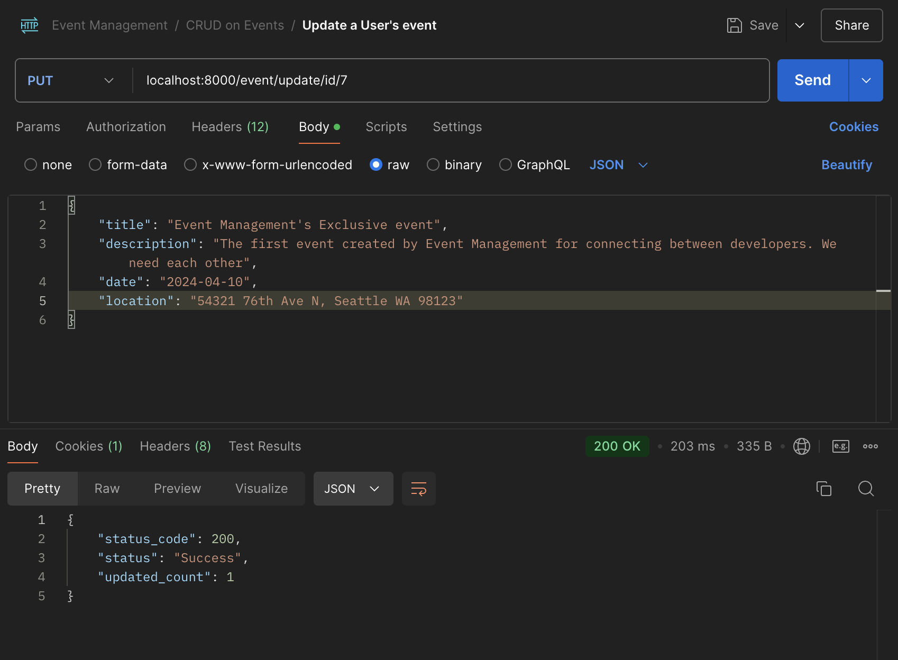

### Registration

This is the application that is responsible to make registration to an event. Here is the endpoint(s) of the services:

- `localhost:8000/registration/register/event/id/<int:event_id>`
    - This is the URL endpoint with PUT method for the logged-in user to register for an event. Once you make a registration, the logged-in user will not be able to make the same registration for the same event again. 
    This is to avoid duplicate registration.
    <br /><br />
    This is when you are trying to make a reservation to an event the first time
    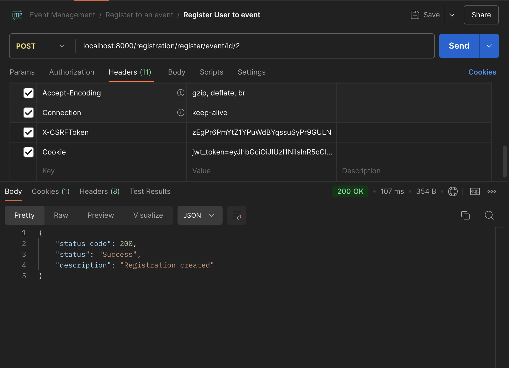
    <br />
    The second time, the API will not do anything because the registration is already made
    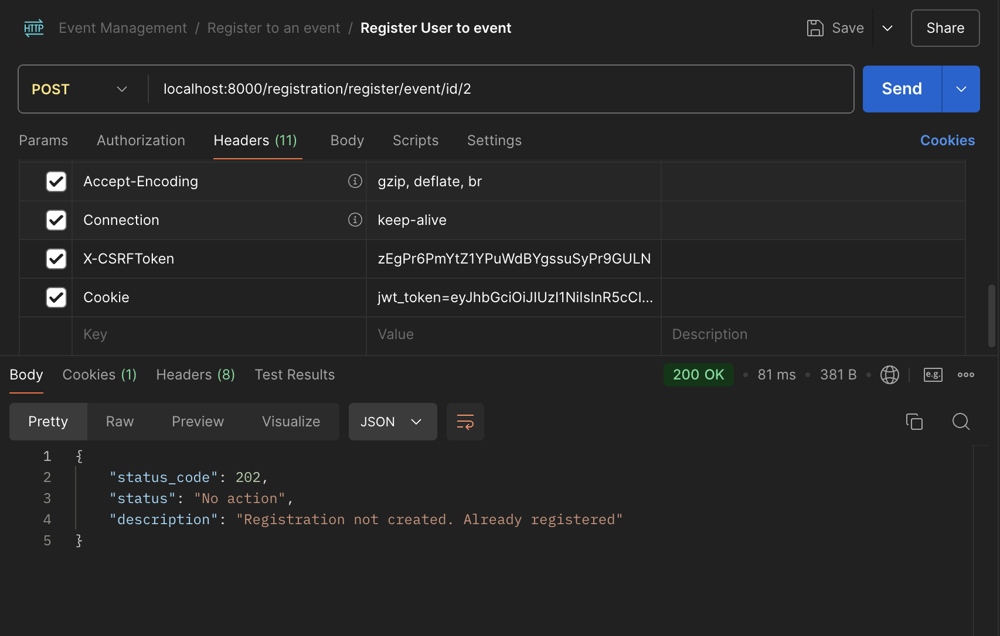