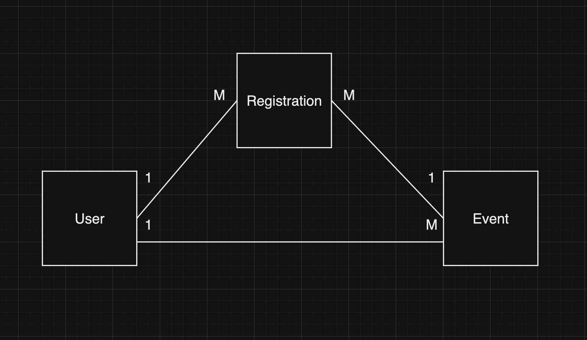

# Event Management

Welcome to my Event Management project. This project builds a system that provides microservices necessary to support event management. The system has APIs for user's logging activities and CRUDs operations to manage user's events and users' registration to an event.

## Table of Contents
- [Setting Up The Project](#setting-up-the-project)
- [Data Model](#data-model)
- [Overview] (#overview)
- [Testing](#testing)

## Setting Up The Project
<br />
1. Clone the repository:
<br />

```bash
git clone https://github.com/tarcisiusdaniel/Event-Management.git
```
After you have cloned the project, make sure that you are navigated to the project directory to proceed

<br />
2. Create a virtual environment (Optional)
<br />
This is in case if you want to isolate the dependencies for this project from your local machine.
</br>

```bash
python3 -m venv venv
```

After that, activate the virtual environment
<br />

MacOS
```bash
source venv/bin/activate
```
Windows
```bash
venv\Scripts\activate
```

<br />
3. Install the Project Dependencies:

```bash
pip3 install -r requirements.txt
```
The ``requirements.txt`` contains all the dependencies that supports this project to work.

<br />
4. Set up the Environment Variables:
<br /> 
For this, you will need .env file that contains the credentials that rooted the services in this project.

The sample of the variables needed will be inside the ``.env.example`` file. 
I will give the values of variables needed for the file to you personally. 

<br />
5. Create and Migrate the database:

```bash
python3 manage.py migrate
```
This will migrate all the data model and create the tables in the database

<br />
6. Run the development server

```bash
python3 manage.py runserver
```
After this command, the project will run, and you will be able to test the microservices built within this project

## Data Model
There are three entities in this data model:
- User
- Event
- Registration

Here is the relations between the models



## Overview


## Testing